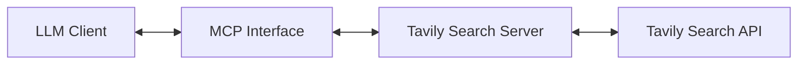

# System Patterns: Tavily Search MCP Server

## System Architecture
The Tavily Search MCP Server follows a straightforward architecture:

The system has two main implementations:
1. **Stdio Transport**: A simple implementation using standard input/output for communication
2. **SSE Transport**: An implementation using Server-Sent Events over HTTP with Express

## Key Technical Decisions

### 1. Model Context Protocol (MCP)
- **Decision**: Use the MCP standard for LLM tool integration
- **Rationale**: Provides a standardized way for LLMs to interact with external tools
- **Implementation**: Uses the `@modelcontextprotocol/sdk` package

### 2. Transport Mechanisms
- **Decision**: Support both stdio and SSE transports
- **Rationale**: 
  - Stdio: Simple, direct integration with local LLM clients
  - SSE: Better for network-based clients, supports reconnection, more web-friendly
- **Implementation**: 
  - Stdio: Uses `StdioServerTransport` from MCP SDK
  - SSE: Uses `SSEServerTransport` with Express for HTTP handling

### 3. API Integration
- **Decision**: Direct integration with Tavily Search API
- **Rationale**: Tavily API is already optimized for LLM consumption
- **Implementation**: Uses fetch API for HTTP requests to Tavily endpoints

### 4. Configuration
- **Decision**: Use environment variables for configuration
- **Rationale**: Follows security best practices for API key management
- **Implementation**: Requires `TAVILY_API_KEY` environment variable

## Design Patterns

### 1. Factory Pattern
- Used in `createServer()` function to instantiate and configure the MCP server

### 2. Adapter Pattern
- Adapts the Tavily API responses to the format expected by MCP clients

### 3. Observer Pattern
- Used for event handling in the SSE implementation (connection, disconnection events)

## Component Relationships

### Server Component
- Responsible for MCP protocol handling
- Manages tool registration and request handling
- Interfaces with the transport layer

### Transport Component
- Handles communication between the server and clients
- Manages connection lifecycle
- Implements the specific transport protocol (stdio or SSE)

### API Integration Component
- Handles authentication with the Tavily API
- Formats requests to the API
- Processes API responses

## Cloudflare Workers Adaptation
For the Cloudflare Workers deployment, we'll need to adapt:

1. **Transport Layer**: Replace Express with Cloudflare Workers' fetch event handlers
2. **Server Component**: Modify to work within the Workers runtime environment
3. **Connection Management**: Adapt the SSE implementation to work with Workers' streaming responses
